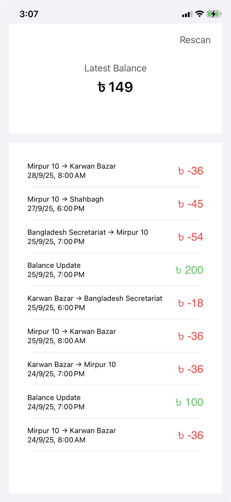

# RapidReader
# Dhaka Metro Rail MRT & RAPID Pass Felica Card Reader

A macOS/iOS app to read and display the latest balance and recent transactions from Dhaka Metro Rail MRT and RAPID Pass Felica cards. Instantly view the card's current balance and the last 10 transactions, including commuter rides and balance updates.

## Features

- **Felica Card Reader Integration**: Read Dhaka Metro Rail MRT and RAPID Pass cards using your device's NFC capabilities.
- **Latest Balance Display**: Instantly shows your current balance as soon as a card is scanned.
- **Transaction History**: View the last 10 transactions, including ride details and balance updates.
- **Secure & Private**: No card data is stored or transmitted externally.

## Screenshots

<!-- Add app screenshots here -->

<!--  -->

## Getting Started

### Prerequisites

- Xcode 15 or later
- A Mac or iOS device with NFC capability (required for card reading)
- macOS 14 / iOS 17 or higher recommended

### Building & Running

1. **Clone the repository:**

    ```sh
    git clone https://github.com/yourusername/dhaka-metro-rail-rapid-pass-reader.git
    cd dhaka-metro-rail-rapid-pass-reader
